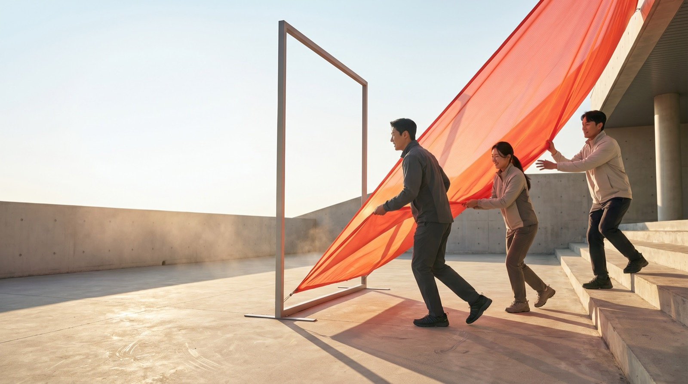
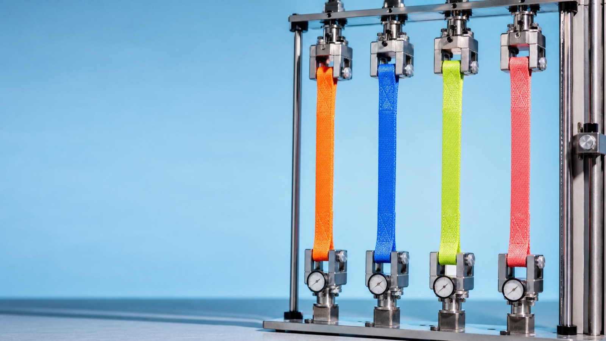
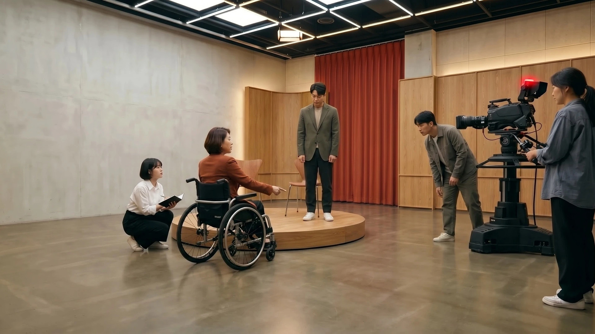
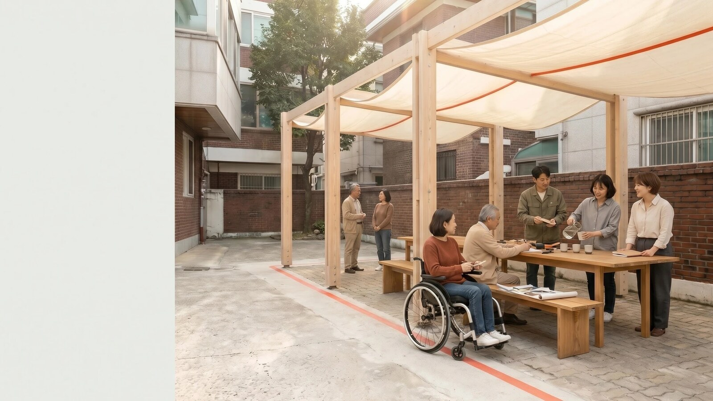

# GBS SUPEX Experiences

SUPEX를 **발견하고, 측정하고, 플레이하고, 현실로 만드는** 네 가지 방송용 인터랙티브 경험입니다.

탁월·단합·적용·실행을 개인의 선택, 현재의 업무 행동, 직접 수행하는 게임, 하나의 아이디어가 완성되는 과정으로 연결했습니다. 네 제품은 각기 다른 질문으로 SUPEX를 경험합니다.

## 네 가지 경험

| | 제품 | 답하는 질문 | 사용자가 하는 일 | 결과 | 체험 시간 |
| --- | --- | --- | --- | --- | --- |
| 01 | **나의 SUPEX** | 나는 어떤 방식으로 최고의 결과를 만드는가? | 일곱 가지 업무 상황에서 행동 선택 | 12가지 SUPEX TYPE | 약 110초 |
| 02 | **SUPEX LICENSE** | 지금 나의 업무 방식은 얼마나 구체적인가? | 네 문항 응답과 얼굴 사진 업로드 | 네 가지 점수와 개인 라이선스 | 약 90초 |
| 03 | **SUPEX RUN** | SUPEX의 네 가지 힘을 실제로 발휘할 수 있는가? | 네 개의 아케이드 스테이지 플레이 | 스테이지별 점수와 종합 코멘트 | 약 60초 |
| 04 | **SUPEX를 현실로** | 촬영 30분 전 막힌 길을 어떻게 함께 해결하는가? | 실사 동화책을 열고 문제부터 방송 시작까지 스크롤 | 자연스럽게 오르는 무대와 피날레 | 약 70초 |

```text
01 발견               02 진단               03 체험               04 현실화
나의 방식 찾기   →   현재 행동 측정   →   네 가지 힘 플레이  →  아이디어 완성
12가지 TYPE          4가지 SCORE          4가지 GAME           1가지 완성 과정
```

| 제품 | 운영 사이트 | GitHub 저장소 |
| --- | --- | --- |
| 나의 SUPEX | [sk-supex.vercel.app](https://sk-supex.vercel.app) | [stpcoder/sk-supex](https://github.com/stpcoder/sk-supex) |
| SUPEX LICENSE | [sk-supex-1.vercel.app](https://sk-supex-1.vercel.app) | [stpcoder/sk-supex-1](https://github.com/stpcoder/sk-supex-1) |
| SUPEX RUN | [sk-supex-2.vercel.app](https://sk-supex-2.vercel.app) | [stpcoder/sk-supex-2](https://github.com/stpcoder/sk-supex-2) |
| SUPEX를 현실로 | [sk-supex-3.vercel.app](https://sk-supex-3.vercel.app) | [stpcoder/sk-supex-3](https://github.com/stpcoder/sk-supex-3) |

## SUPEX를 읽는 기준

| 힘 | 이 프로젝트에서의 의미 | 확인하는 행동 |
| --- | --- | --- |
| **탁월** | 도달할 수준과 완료 기준을 높이는 힘 | 최고의 결과와 검증 방법을 먼저 정한다 |
| **단합** | 서로 다른 사람과 역할을 하나의 결과로 잇는 힘 | 목표, 담당, 결정 방식을 함께 맞춘다 |
| **적용** | 새로운 가능성을 실제 업무에 맞게 시험하고 다듬는 힘 | 작은 범위에서 확인하고 결과를 반영한다 |
| **실행** | 생각을 첫 결과물로 만들고 끝까지 움직이는 힘 | 첫 행동, 담당자, 완료 시점을 정한다 |

## 01 · 나의 SUPEX



일곱 가지 업무 장면에서 자신이 결과를 만드는 방식을 찾습니다. 팀워크, VWBE, 높은 목표에 도전하는 자세까지 함께 살펴보고 가장 강한 두 힘의 순서로 12가지 타입 가운데 하나를 결정합니다.

```text
인트로 → 7개 상황 선택 → 선택 장면 결합 → SUPEX 완성 → 개인 TYPE → 다른 성향 보기
```

- 질문마다 세 개의 현실적인 선택지를 제공합니다.
- 선택지에 집중하면 배경 장면이 즉시 바뀝니다.
- 선택 후 붉은 천 매치컷으로 다음 상황이 이어집니다.
- 마지막에는 일곱 장면이 모이며 `SUPEX` 글자가 채워집니다.
- 결과에서 타입 코드, 이름, 설명, 다음 행동, 네 가지 점수를 확인합니다.
- `다른 성향 보기`에서 12개 타입과 모든 선택의 의미를 살펴볼 수 있습니다.

이 경험은 **성과를 만드는 나의 우선순위**를 발견합니다.

[제품 상세 보기](./docs/PRODUCTS.md#01--나의-supex) · [지금 체험하기](https://sk-supex.vercel.app)

## 02 · SUPEX LICENSE



최근 업무에서 실제로 선택하는 행동을 네 문항으로 확인합니다. 탁월·단합·적용·실행은 각각 40·60·80·100점 가운데 하나로 계산되며, 네 점수와 개인 정보가 인터랙티브 라이선스에 담깁니다.

```text
이름·회사·직무 → 4개 객관식 문항 → 4개 점수 → 사진 업로드 → 빛 각인 → SUPEX LICENSE
```

- 한 화면에 한 문항만 보여 집중도를 높였습니다.
- 네 점수를 각각 독립적으로 보여줍니다.
- 점수 결과에는 가장 강한 SUPEX와 짧은 행동 해석이 함께 표시됩니다.
- 사진을 업로드하면 정장과 SK 라펠핀이 적용된 포트레이트를 생성합니다.
- 라이선스는 무지개 홀로그램을 기본으로 다섯 가지 색상을 지원합니다.
- 포인터에 따라 카드의 각도, 빛, 스펙트럼이 움직입니다.
- 완성된 라이선스는 고해상도 PNG로 저장할 수 있습니다.

입력 이미지는 변환 요청에만 사용하며 서비스에서 별도로 저장하지 않습니다.

[제품 상세 보기](./docs/PRODUCTS.md#02--supex-license) · [지금 체험하기](https://sk-supex-1.vercel.app)

## 03 · SUPEX RUN


탁월·단합·적용·실행을 서로 다른 네 가지 행동 게임으로 바꾼 약 1분 분량의 시네마틱 아케이드입니다.

| 순서 | 게임 | 플레이 | 경험하는 SUPEX |
| --- | --- | --- | --- |
| 탁월 | 기준 맞추기 | 바깥 원부터 회전 표시를 기준선에 맞춘다 | 정한 기준에 정확히 도달한다 |
| 단합 | 하나로 잇기 | 손을 떼지 않고 1부터 7까지 연결한다 | 각자의 일을 하나의 흐름으로 잇는다 |
| 적용 | 변화 반영하기 | 가운데 목표와 같은 단어를 빠르게 고른다 | 바뀐 기준을 확인하고 즉시 반영한다 |
| 실행 | 순서대로 끝내기 | 흩어진 숫자를 1부터 10까지 완성한다 | 정한 일을 바로 시작해 끝까지 마친다 |

```text
인트로 → 탁월 → 단합 → 적용 → 실행 → 종합 점수와 코멘트 → 다시 시작
```

- 실제 플레이 제한시간은 총 44초입니다.
- 클릭, 키보드, 터치 입력을 모두 지원합니다.
- 각 게임은 정확도, 완성도, 반응 속도를 다르게 반영합니다.
- 최종 점수는 네 스테이지의 평균이며 점수 구간별 코멘트가 표시됩니다.
- 새로 시작할 때마다 게임 안의 배치와 보기 순서가 달라집니다.


[제품 상세 보기](./docs/PRODUCTS.md#03--supex-run) · [지금 체험하기](https://sk-supex-2.vercel.app)

## 04 · SUPEX를 현실로



촬영 30분 전, 휠체어 이용 출연자가 방송 무대 앞에서 멈춥니다. 출연자가 필요한 길을 말하고 제작진과 경사로를 함께 조립합니다. 실제 촬영 동선에서 직접 확인하고 발견한 문제를 곧바로 고쳐, 누구나 자연스럽게 오르는 무대에서 방송을 시작합니다.

```text
실사 동화책 → 막힌 길 → 단합 → 적용 → 실행 → 탁월 → 따로 또 같이, 우리는 SK입니다.
```

- 첫 화면에서 배경을 분리한 극사실 동화책이 하나의 종이 공간 위에서 펼쳐지고, 오른쪽 페이지의 실제 문제 장면 안으로 들어갑니다.
- 페이지 번호와 진행 카운터 없이 장면과 짧은 검정 캡션에만 집중합니다.
- 단합은 공동 조립, 적용은 실제 촬영 동선 시험, 실행은 즉시 수정과 설치, 탁월은 자연스러운 진입과 방송 시작을 보여줍니다.
- 데스크톱과 모바일에 맞춘 별도 비주얼을 사용합니다.
- 마지막 장면에 들어서면 `SUPEX`가 끝까지 채워진 뒤 화면에 남습니다.
- 피날레는 `따로 또 같이, 우리는 SK입니다.`로 이야기를 맺습니다.

이 경험은 **생각을 실제 결과로 만드는 SUPEX의 과정**을 보여줍니다.



[제품 상세 보기](./docs/PRODUCTS.md#04--supex를-현실로) · [지금 체험하기](https://sk-supex-3.vercel.app)

## 방송에서 보여주는 순서

네 제품을 이어서 시연하면 SUPEX가 개인의 성향에서 현재 행동과 수행을 거쳐 실제 결과로 이어집니다.

1. **발견** — 나의 SUPEX에서 한 가지 상황을 선택하고 12가지 타입 결과를 보여줍니다.
2. **진단** — SUPEX LICENSE에서 네 점수와 홀로그램 라이선스 발급을 보여줍니다.
3. **체험** — SUPEX RUN에서 한 스테이지를 플레이하고 최종 점수 화면으로 마무리합니다.
4. **현실화** — SUPEX를 현실로에서 동화책을 열고 막힌 길을 함께 해결해 방송을 시작하는 과정과 피날레를 보여줍니다.

전체 진행안과 화면별 멘트는 [방송 시연 가이드](./docs/DEMO_GUIDE.md)에 정리했습니다.

## 공통 사운드 디자인

네 제품은 D장조 펜타토닉의 맑은 유리·피아노 음색을 공유합니다.

- 나의 SUPEX는 선택 3음, 네 단계 완성음, 타입 결과 화음으로 탐색의 흐름을 들려줍니다.
- SUPEX LICENSE는 답변별 상승음, 점수 아르페지오, 네 SUPEX 발급음, 라이선스 완성 코드로 이어집니다.
- SUPEX RUN은 게임 행동 효과음과 스테이지마다 리듬·음역이 달라지는 저음량 BGM을 사용합니다.
- SUPEX를 현실로는 책 펼침음, 네 단계 전환음, 피날레 화음으로 현실화 과정을 연결합니다.
- 모든 소리는 외부 음원 파일 없이 Web Audio API로 합성합니다.
- 첫 사용자 입력 이후에 활성화되며 제품별 음소거 설정을 기억합니다.

## 저장소 구조

이 저장소는 네 제품을 연결하는 허브입니다. 각 제품은 독립 저장소와 Vercel 프로젝트를 유지하며 Git 서브모듈로 연결됩니다.

```text
gbs/
├── README.md                 # 전체 프로젝트 소개
├── docs/
│   ├── PRODUCTS.md          # 제품별 기획과 전체 콘텐츠
│   ├── DEMO_GUIDE.md        # 방송·현장 시연 순서
│   ├── SCREENSHOT_GUIDE.md  # 화면 캡처 목록과 기준
│   └── images/              # README 대표 비주얼
├── sk-supex/                # Project 1 · 성향 탐색기
├── sk-supex-1/              # Project 2 · 점수 진단과 라이선스
├── sk-supex-2/              # Project 3 · 시네마틱 아케이드
└── sk-supex-3/              # Project 4 · 막힌 길을 함께 해결하는 실사 동화책 스토리
```

처음 내려받을 때는 서브모듈을 함께 복제합니다.

```bash
git clone --recurse-submodules https://github.com/stpcoder/gbs.git
cd gbs
```

이미 복제한 저장소에서는 다음 명령으로 네 프로젝트를 받습니다.

```bash
git submodule update --init --recursive
```

각 제품은 해당 폴더에서 독립적으로 실행합니다.

```bash
cd sk-supex
npm install
npm run dev
```

다른 세 제품도 같은 방식으로 실행하며 기본 포트가 사용 중이면 Next.js가 다음 포트를 자동으로 선택합니다.

## 기술 구성

- Next.js 16 App Router
- React 19 · TypeScript
- Framer Motion 기반 장면 전환과 인터랙션
- Web Audio API 기반 클릭 차임과 생성형 게임 BGM
- Pretendard Variable 한글 타이포그래피
- Vercel 개별 프로덕션 배포
- Google Vertex AI 이미지·문장 생성
- Vercel OIDC와 Google Workload Identity Federation

런타임 AI는 SUPEX LICENSE의 짧은 해석과 포트레이트 생성에 사용합니다. 나의 SUPEX와 SUPEX RUN, SUPEX를 현실로는 미리 제작한 비주얼 자산과 로컬 인터랙션으로 동작합니다.

## 문서

- [제품별 전체 기획과 콘텐츠](./docs/PRODUCTS.md)
- [방송·현장 시연 가이드](./docs/DEMO_GUIDE.md)
- [화면 캡처 구성 가이드](./docs/SCREENSHOT_GUIDE.md)
