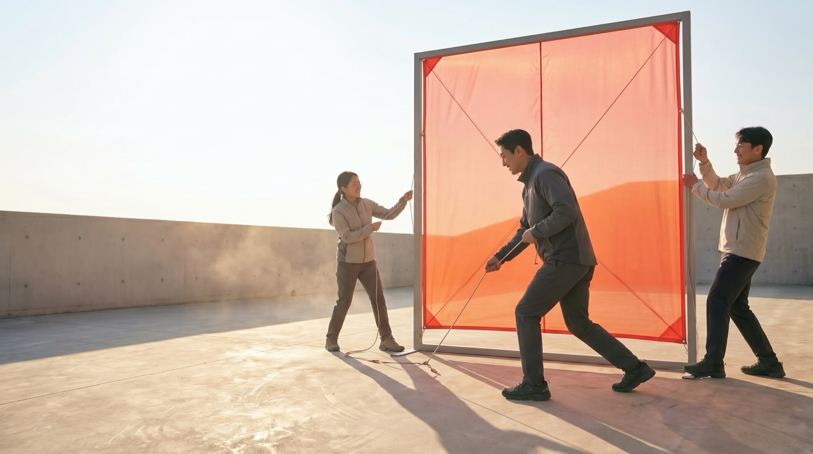

# SUPEX 제품 가이드

네 제품이 다루는 질문, 콘텐츠, 결과 로직을 한 문서에서 확인할 수 있습니다.

## 전체 설계

| 제품 | 관점 | 핵심 입력 | 핵심 결과 | SUPEX를 느끼는 방식 |
| --- | --- | --- | --- | --- |
| 나의 SUPEX | 개인의 우선순위 | 업무 상황별 선택 | 12가지 TYPE | 내가 결과를 만드는 방식 발견 |
| SUPEX LICENSE | 현재 행동의 구체성 | 네 가지 객관식 응답 | 네 점수와 라이선스 | 현재 수준을 숫자로 확인 |
| SUPEX RUN | 실제 수행 | 네 가지 게임 플레이 | 개별·종합 점수 | 행동으로 직접 체험 |
| SUPEX REAL | 생각이 현실이 되는 과정 | 포인터와 스크롤 | 모두가 사용하는 공간과 피날레 | 아이디어가 삶의 장면이 되는 흐름 체험 |

## 01 · 나의 SUPEX

### 목적

업무에서 무엇을 먼저 보고 어떻게 결과를 만드는지 탐색합니다. 네 질문의 선택을 합산해 탁월·단합·적용·실행 점수를 계산하고, 상위 두 힘의 순서로 타입을 결정합니다.

### 질문과 선택

| 단계 | 질문 | 선택지 |
| --- | --- | --- |
| 1 | 새 과제를 맡으면 무엇부터 하는가? | 고객이 체감할 최고의 결과를 정한다 · 함께할 사람과 역할을 정한다 · 작은 결과를 바로 만들어본다 |
| 2 | 의견이 엇갈리면 무엇부터 하는가? | 모두가 동의할 목표를 확인한다 · 각 의견의 근거와 장단점을 정리한다 · 결정 시점과 담당자를 정한다 |
| 3 | 새로운 아이디어를 적용할 때? | 업무 목표에 맞는 활용 기준을 정한다 · 팀이 함께 사용할 방식과 역할을 정한다 · 작은 업무부터 직접 시험해본다 |
| 4 | 성과를 높이는 나의 방식은? | 성공 기준을 세우고 완성도를 높인다 · 각자의 강점을 연결해 추진력을 만든다 · 빠르게 실행하고 결과를 보며 개선한다 |

### 12가지 SUPEX TYPE

| 코드 | 타입 | 핵심 특징 | 제안 행동 |
| --- | --- | --- | --- |
| XU | 기준을 함께 세우는 설계자 | 높은 기준을 세우고 구성원의 강점을 같은 방향으로 모은다 | 중요한 성공 기준을 한 문장으로 정하고 팀과 합의한다 |
| XA | 높은 기준을 현실로 옮기는 구현자 | 원하는 수준을 분명히 하고 아이디어를 업무에 맞게 다듬는다 | 한 업무에 적용할 기준을 세 가지로 정한다 |
| XE | 최고 수준의 결과를 만드는 완성자 | 기준을 먼저 세우고 움직이며 완성도를 높인다 | 오늘 확인할 첫 산출물을 하나 정한다 |
| UX | 사람의 힘으로 기준을 높이는 조율자 | 서로 다른 관점을 모아 모두가 납득할 기준을 만든다 | 각자가 기대하는 최고의 결과를 한 문장씩 나눈다 |
| UA | 함께 쓰는 방식을 만드는 연결자 | 아이디어를 팀이 함께 활용할 방식으로 바꾼다 | 먼저 사용할 사람, 활용 장면, 역할을 정한다 |
| UE | 팀을 한 번에 움직이는 추진자 | 역할과 시점을 빠르게 맞춰 함께 움직인다 | 다음 행동의 담당자와 완료 시점을 정한다 |
| AX | 현장에서 완성도를 높이는 검증자 | 실제 업무에서 시험하며 더 높은 기준에 맞게 다듬는다 | 성공 조건 세 가지와 가장 작은 테스트를 설계한다 |
| AU | 아이디어를 모두의 방식으로 바꾸는 번역가 | 새로운 아이디어를 팀이 이해하고 함께 쓸 구조로 만든다 | 사용 방법과 역할을 10분 안에 설명할 수 있게 정리한다 |
| AE | 작게 시험해 빠르게 넓히는 실험가 | 작은 실행으로 효과를 확인하고 작동하는 것부터 확장한다 | 48시간 안에 결과를 볼 실험을 시작한다 |
| EX | 행동으로 최고 수준을 증명하는 돌파자 | 먼저 결과를 만들고 그 결과로 기준을 높인다 | 오늘 다른 사람에게 보여줄 초안을 만든다 |
| EU | 사람을 모아 결과를 만드는 리더 | 빠르게 시작하고 각자의 강점을 하나의 결과로 잇는다 | 각 담당자의 역할과 완료 시점을 정한다 |
| EA | 움직이며 답을 찾는 개척자 | 빠르게 시도하고 현장의 답을 다음 실행에 반영한다 | 오늘 안에 실행하고 관찰하고 수정한다 |

### 결과 로직

- 각 선택은 탁월·단합·적용·실행 가운데 여러 힘에 가중치를 더합니다.
- 누적 원점수를 백분율로 변환해 네 개의 원형 점수로 보여줍니다.
- 상위 두 힘의 순서가 타입 코드를 만듭니다.
- 동점은 후반 질문의 가중치와 `탁월 → 단합 → 적용 → 실행` 순서로 결정합니다.
- 런타임에서 사용자 데이터나 응답을 서버에 저장하지 않습니다.
- 이미지 생성 AI는 현재 화면에서 직접 호출되지 않으며 사전 제작 자산 생성에 사용했습니다.

### 디자인 서사

같은 구성원들이 하나의 주황색 구조물을 완성하는 연속 장면으로 구성했습니다. 밝은 콘크리트 공간, 자연광, 회색 의상, SK Red·Orange 재료가 현실적인 광고 캠페인 톤을 만듭니다.

### 사운드

선택은 짧은 3음으로 확정하고, 마지막 네 장면이 모일 때 `D·E·F♯·A`가 차례로 쌓입니다. 결과 화살표를 누르면 D장조 화음으로 타입 공개를 마무리합니다.

## 02 · SUPEX LICENSE

### 목적

현재 업무 행동이 어느 수준까지 구체화되어 있는지 네 문항으로 확인합니다. 지금 실행하는 방식을 직접 측정합니다.

### 입력

- 이름
- 소속 회사
- 직무
- 네 개의 객관식 응답
- 얼굴 사진 JPEG·PNG·WebP, 최대 12MB

### 문항과 점수

각 문항은 해당 SUPEX 점수를 40·60·80·100 가운데 하나로 결정합니다.

| SUPEX | 질문 | 40 | 60 | 80 | 100 |
| --- | --- | --- | --- | --- | --- |
| 탁월 | 일을 시작할 때 끝내는 기준을 어디까지 정해 두나요? | 목표와 기대 결과 | 결과물 형태와 범위 | 품질 기준과 검토 시점 | 완료 기준과 확인 방법 합의 |
| 단합 | 여럿이 함께 일할 때 역할과 진행 방식을 어디까지 정하나요? | 함께할 사람과 목표 | 맡을 일 분담 | 담당자와 협업 순서 | 담당과 결정 방식 합의 |
| 적용 | 새로운 방식을 업무에 적용할 때 어떻게 시작하나요? | 익숙한 업무부터 | 필요한 조건 확인 | 작은 범위 시험 | 결과 반영과 방식 개선 |
| 실행 | 실행을 시작할 때 무엇까지 정해 두나요? | 가장 먼저 할 일 | 첫 단계와 담당자 | 담당자와 완료 시점 | 첫 결과물, 담당자, 완료 시점 |

### 라이선스에 담기는 내용

- 공식 SK 로고와 SUPEX 워드마크
- AI로 생성한 정장 포트레이트와 SK 라펠핀
- 이름
- 회사와 직무
- 대표 SUPEX 강점
- 탁월·단합·적용·실행 원형 점수

### 인터랙션

- 기본 레인보우 홀로그램
- 펄, 오렌지, 코발트, 그래파이트 색상
- 포인터 위치에 반응하는 3D 틸트
- 움직이는 정반사와 스펙트럼 밴드
- 3배 해상도 PNG 저장
- 모션 감소 설정 지원

### AI와 개인정보

- 점수는 선택값으로 결정되며 AI가 숫자를 변경하지 않습니다.
- AI는 최대 35자의 행동 해석과 라이선스용 포트레이트를 생성합니다.
- 이름과 회사는 생성 API로 전송하지 않습니다.
- 입력 사진은 포트레이트 변환 요청에 사용하며 서버 저장 로직이 없습니다.
- 브라우저에서 이미지를 축소한 뒤 요청하고 응답 캐시를 사용하지 않습니다.

### 사운드

답변 위치에 따라 네 음이 상승하고, 점수 공개 아르페지오와 네 단계 발급음이 라이선스 완성 코드로 이어집니다.

## 03 · SUPEX RUN

### 목적

SUPEX의 네 가지 힘을 읽는 개념에서 손으로 수행하는 행동으로 전환합니다. 네 게임은 서로 다른 판단과 조작을 요구합니다.

### 전체 흐름

1. 인트로에서 시작합니다.
2. 각 스테이지 전에 SUPEX의 의미와 게임 이름을 확인합니다.
3. 한 줄 튜토리얼에 따라 게임을 수행합니다.
4. 스테이지 점수와 결과 문구를 확인합니다.
5. 탁월, 단합, 적용, 실행 순서로 진행합니다.
6. 종합 점수와 구간별 코멘트를 확인합니다.

### 게임 구성

| SUPEX | 제한시간 | 수행 | 주요 점수 요소 |
| --- | ---: | --- | --- |
| 탁월 | 10초 | 바깥 원부터 세 개의 회전 표시를 위 기준선에 맞춘다 | 완료 비율, 평균 정밀도, 실패 횟수 |
| 단합 | 11초 | 손을 떼지 않고 1부터 7까지 하나의 선으로 연결한다 | 연결 완성도, 경로 효율, 속도, 손을 뗀 횟수 |
| 적용 | 13초 | 바뀌는 목표와 같은 단어를 여섯 보기에서 고른다 | 다섯 문제 정답률과 평균 반응 속도 |
| 실행 | 10초 | 흩어진 숫자를 1부터 10까지 순서대로 완료한다 | 진행률, 반응 속도, 정확도 |

### 결과

- 각 스테이지는 40~100점 범위로 표시됩니다.
- 종합 점수는 네 스테이지 점수의 반올림 평균입니다.
- 종합 코멘트는 60·70·80·90점을 경계로 다섯 단계입니다.
- `다시 시작`하면 새로운 배치와 순서로 진행됩니다.

### 접근성과 입력

- 마우스, 키보드, 터치 입력
- 모바일 전용 터치 판정
- 일시정지 버튼과 `P` 키
- 햅틱 피드백
- 모션 감소 설정
- 이미지 로딩 실패 시 CSS 배경으로 계속 플레이

### 사운드

각 게임은 성공·실패·연결 행동을 다른 음으로 알려줍니다. 플레이 중에는 스테이지별 저음량 앰비언트가 흐르며 일시정지와 결과 전환에 맞춰 함께 멈춥니다.

## 04 · SUPEX REAL

### 목적

한 줄의 생각이 탁월·단합·적용·실행을 거쳐 모두가 사용하는 실제 공간이 되는 과정을 경험합니다. 같은 사람과 같은 장소가 끝까지 이어집니다.

### 전체 흐름

1. 포인터 또는 모바일 슬라이더로 같은 공간의 스케치와 실사를 비교합니다.
2. 스크롤하며 탁월, 단합, 적용, 실행의 장면을 차례로 확인합니다.
3. 붉은 연필선이 기준선, 모형, 이동 경로로 이어지는 과정을 봅니다.
4. 사람들이 실제로 머무는 공간과 `SUPEX` 피날레를 확인합니다.

### 네 단계

| SUPEX | 장면 | 화면에서 확인하는 행동 |
| --- | --- | --- |
| 탁월 | 사람 크기의 현장 확인 | 이동 폭과 그늘을 확인해 완성 기준을 정한다 |
| 단합 | 하나의 모형 완성 | 서로 다른 경험을 같은 그림에 모은다 |
| 적용 | 실제 이용 장면 관찰 | 사람의 움직임을 보고 높이와 동선을 고친다 |
| 실행 | 최종 조립과 첫 사용 | 조립을 마치고 사람이 머무는 순간까지 이어간다 |

### 인터랙션과 비주얼

- 데스크톱 포인터와 모바일 슬라이더 기반의 스케치·실사 비교
- 420svh 고정 스크롤 구간과 네 장면의 크로스페이드
- 같은 다섯 사람, 마당, 구조물, 붉은 선을 유지하는 연속 서사
- 16:9 데스크톱과 9:16 모바일 전용 이미지
- 모션 감소 설정 지원
- 첫 비교, 단계 전환, 피날레에 맞춘 Web Audio 차임

### 이미지 제작

모든 장면은 Google Vertex AI의 `gemini-3-pro-image`로 생성한 뒤 WebP로 정리했습니다. 한국 도심 마당, 다섯 사람, 목재 쉼터, 붉은 선을 모든 장면의 공통 요소로 사용합니다. 모델·프롬프트·결과 파일의 해시를 생성 매니페스트에 기록합니다.

## 기술과 운영

| 영역 | 구성 |
| --- | --- |
| 프론트엔드 | Next.js 16, React 19, TypeScript |
| 모션 | Framer Motion 12, CSS, SVG |
| 타이포그래피 | Pretendard Variable |
| 배포 | Vercel 독립 프로젝트 4개 |
| AI | Google Vertex AI Gemini |
| 인증 | Vercel OIDC, Google Workload Identity Federation |
| 이미지 처리 | Sharp |
