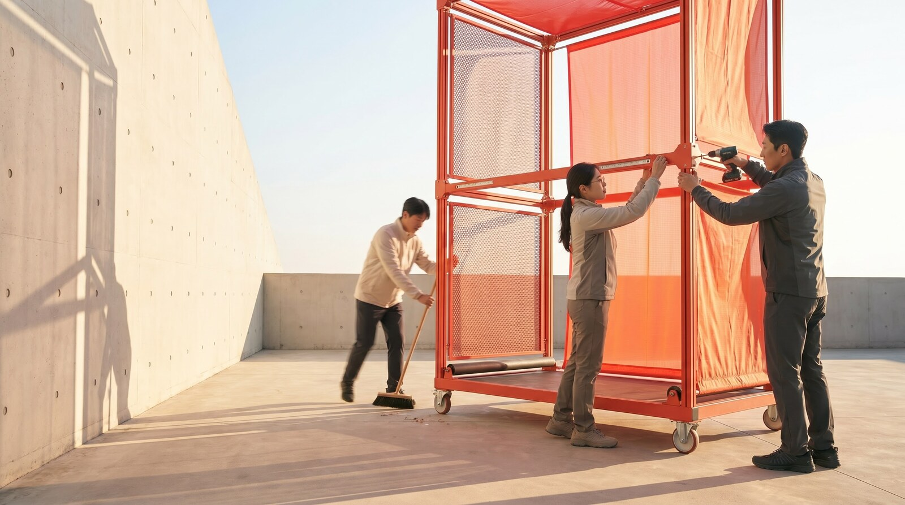
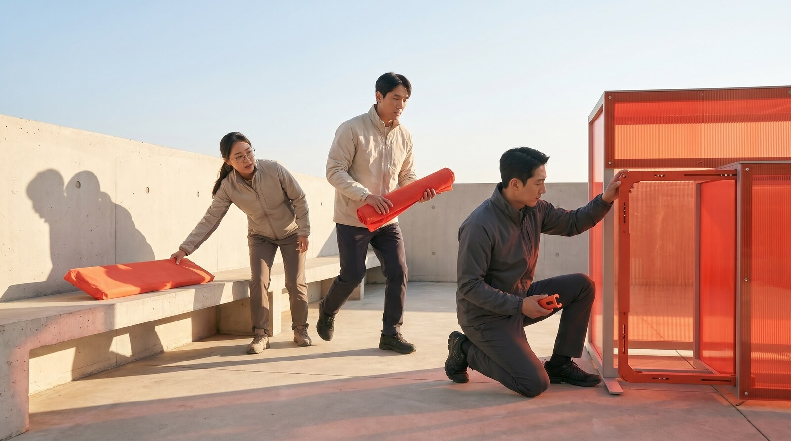

# SUPEX 제품 가이드

네 제품이 다루는 질문, 콘텐츠, 결과 로직을 한 문서에서 확인할 수 있습니다.

## 전체 설계

| 제품 | 관점 | 핵심 입력 | 핵심 결과 | SUPEX를 느끼는 방식 |
| --- | --- | --- | --- | --- |
| 나의 SUPEX | 개인의 우선순위 | 업무 상황별 선택 | 12가지 TYPE | 내가 결과를 만드는 방식 발견 |
| SUPEX LICENSE | 현재 행동의 구체성 | 네 가지 객관식 응답 | 네 점수와 라이선스 | 현재 수준을 숫자로 확인 |
| SUPEX RUN | 실제 수행 | 네 가지 게임 플레이 | 개별·종합 점수 | 행동으로 직접 체험 |
| SUPEX를 현실로 | 촬영 직전 막힌 길을 함께 해결하는 과정 | 실사 동화책과 스크롤 | 자연스럽게 오르는 무대와 피날레 | 네 행동이 방송 시작으로 이어지는 흐름 체험 |

## 01 · 나의 SUPEX

### 목적

업무에서 무엇을 먼저 보고 어떻게 결과를 만드는지 탐색합니다. 일곱 질문의 선택을 합산해 탁월·단합·적응·실행 점수를 계산하고, 상위 두 힘의 순서로 타입을 결정합니다.

### 질문과 선택

| 단계 | 질문 | 선택지 |
| --- | --- | --- |
| 1 | 새 과제를 맡으면 무엇부터 하는가? | 고객이 체감할 최고의 결과를 정한다 · 함께할 사람과 역할을 정한다 · 작은 결과를 바로 만들어본다 |
| 2 | 의견이 엇갈리면 무엇부터 하는가? | 모두가 동의할 목표를 확인한다 · 각 의견의 근거와 장단점을 정리한다 · 결정 시점과 담당자를 정한다 |
| 3 | 팀으로 미션을 수행할 때 가장 중요하게 보는 것은? | 모두가 같은 성공 기준과 우선순위를 이해한다 · 각자의 강점이 가장 필요한 역할에 연결된다 · 막힌 지점을 함께 풀고 약속한 결과를 끝까지 만든다 |
| 4 | 새로운 환경에 적응할 때? | 업무 목표에 맞는 활용 기준을 정한다 · 팀이 함께 사용할 방식과 역할을 정한다 · 작은 업무부터 직접 시험해본다 |
| 5 | VWBE를 발휘해 더 나은 일을 시작할 때 중요한 것은? | 일의 목적과 내가 만들 변화를 분명히 이해한다 · 기존 방식을 깊이 생각해 더 나은 해법을 제안한다 · 필요한 동료를 연결하고 첫 행동을 바로 시작한다 |
| 6 | 높은 목표 앞에서 나는 어떻게 한계를 넘는가? | 도달할 최고 수준과 성공 기준을 구체적으로 세운다 · 현재의 한계를 분석하고 새로운 방법을 설계한다 · 먼저 실행하고 결과를 확인하며 목표를 더 높인다 |
| 7 | 성과를 높이는 나의 방식은? | 성공 기준을 세우고 완성도를 높인다 · 각자의 강점을 연결해 추진력을 만든다 · 빠르게 실행하고 결과를 보며 개선한다 |

### 12가지 SUPEX TYPE

| 코드 | 타입 | 핵심 특징 | 제안 행동 |
| --- | --- | --- | --- |
| XU | 기준을 함께 세우는 설계자 | 높은 기준을 세우고 구성원의 강점을 같은 방향으로 모은다 | 중요한 성공 기준을 한 문장으로 정하고 팀과 합의한다 |
| XA | 높은 기준을 현실로 옮기는 구현자 | 원하는 수준을 분명히 하고 아이디어를 업무에 맞게 다듬는다 | 한 업무에서 조정할 기준을 세 가지로 정한다 |
| XE | 최고 수준의 결과를 만드는 완성자 | 기준을 먼저 세우고 움직이며 완성도를 높인다 | 오늘 확인할 첫 산출물을 하나 정한다 |
| UX | 사람의 힘으로 기준을 높이는 조율자 | 서로 다른 관점을 모아 모두가 납득할 기준을 만든다 | 각자가 기대하는 최고의 결과를 한 문장씩 나눈다 |
| UA | 함께 쓰는 방식을 만드는 연결자 | 아이디어를 팀이 함께 활용할 방식으로 바꾼다 | 먼저 사용할 사람, 활용 장면, 역할을 정한다 |
| UE | 팀을 한 번에 움직이는 추진자 | 역할과 시점을 빠르게 맞춰 함께 움직인다 | 다음 행동의 담당자와 완료 시점을 정한다 |
| AX | 현장에서 완성도를 높이는 검증자 | 실제 업무에서 시험하며 더 높은 기준에 맞게 다듬는다 | 성공 조건 세 가지와 가장 작은 테스트를 설계한다 |
| AU | 아이디어를 모두의 방식으로 바꾸는 번역가 | 새로운 아이디어를 팀이 이해하고 함께 쓸 구조로 만든다 | 사용 방법과 역할을 10분 안에 설명할 수 있게 정리한다 |
| AE | 작게 시험해 빠르게 넓히는 실험가 | 작은 실행으로 효과를 확인하고 작동하는 것부터 확장한다 | 48시간 안에 결과를 볼 실험을 시작한다 |
| EX | 행동으로 최고 수준을 증명하는 돌파자 | 먼저 결과를 만들고 그 결과로 기준을 높인다 | 오늘 다른 사람에게 보여줄 초안을 만든다 |
| EU | 사람을 모아 결과를 만드는 리더 | 빠르게 시작하고 각자의 강점을 하나의 결과로 잇는다 | 각 담당자의 역할과 완료 시점을 정한다 |
| EA | 움직이며 답을 찾는 개척자 | 빠르게 시도하고 현장의 답을 다음 실행에 반영한다 | 오늘 안에 실행하고 관찰하고 수정한다 |

### 결과 로직

- 각 선택은 탁월·단합·적응·실행 가운데 여러 힘에 가중치를 더합니다.
- 각 힘의 최대 가능 점수로 보정한 값을 네 개의 원형 점수로 보여줍니다.
- 상위 두 힘의 순서가 타입 코드를 만듭니다.
- 동점은 후반 질문의 가중치와 `탁월 → 단합 → 적응 → 실행` 순서로 결정합니다.
- 런타임에서 사용자 데이터나 응답을 서버에 저장하지 않습니다.
- 이미지 생성 AI는 현재 화면에서 직접 호출되지 않으며 사전 제작 자산 생성에 사용했습니다.

### 디자인 서사

같은 구성원들이 하나의 주황색 구조물을 완성하는 연속 장면으로 구성했습니다. 밝은 콘크리트 공간, 자연광, 회색 의상, SK Red·Orange 재료가 현실적인 광고 캠페인 톤을 만듭니다.

### 사운드

선택은 짧은 3음으로 확정하고, 마지막 일곱 장면이 모일 때 `D·E·F♯·A`가 차례로 쌓입니다. 결과 화살표를 누르면 D장조 화음으로 타입 공개를 마무리합니다.

## 02 · SUPEX LICENSE

### 목적

현재 업무 행동이 어느 수준까지 구체화되어 있는지 네 문항으로 확인합니다. 지금 실행하는 방식을 직접 측정합니다.

### 입력

- 이름
- 소속 회사
- 직무
- 네 개의 객관식 응답
- 얼굴 사진 JPEG·PNG·WebP, 최대 12MB

### 문항과 점수

각 문항은 해당 SUPEX 점수를 40·60·80·100 가운데 하나로 결정합니다.

| SUPEX | 질문 | 40 | 60 | 80 | 100 |
| --- | --- | --- | --- | --- | --- |
| 탁월 | 일을 시작할 때 끝내는 기준을 어디까지 정해 두나요? | 목표와 기대 결과 | 결과물 형태와 범위 | 품질 기준과 검토 시점 | 완료 기준과 확인 방법 합의 |
| 단합 | 여럿이 함께 일할 때 역할과 진행 방식을 어디까지 정하나요? | 함께할 사람과 목표 | 맡을 일 분담 | 담당자와 협업 순서 | 담당과 결정 방식 합의 |
| 적응 | 새로운 환경에 적응할 때 어떻게 시작하나요? | 익숙한 업무부터 | 필요한 조건 확인 | 작은 범위 시험 | 결과 반영과 방식 개선 |
| 실행 | 실행을 시작할 때 무엇까지 정해 두나요? | 가장 먼저 할 일 | 첫 단계와 담당자 | 담당자와 완료 시점 | 첫 결과물, 담당자, 완료 시점 |

### 라이선스에 담기는 내용

- 공식 SK 로고와 SUPEX 워드마크
- AI로 생성한 정장 포트레이트와 SK 라펠핀
- 이름
- 회사와 직무
- 대표 SUPEX 강점
- 탁월·단합·적응·실행 원형 점수

### 인터랙션

- 기본 레인보우 홀로그램
- 펄, 오렌지, 코발트, 그래파이트 색상
- 포인터 위치에 반응하는 3D 틸트
- 움직이는 정반사와 스펙트럼 밴드
- 3배 해상도 PNG 저장
- 모션 감소 설정 지원

### AI와 개인정보

- 점수는 선택값으로 결정되며 AI가 숫자를 변경하지 않습니다.
- AI는 최대 35자의 행동 해석과 라이선스용 포트레이트를 생성합니다.
- 이름과 회사는 생성 API로 전송하지 않습니다.
- 입력 사진은 포트레이트 변환 요청에 사용하며 서버 저장 로직이 없습니다.
- 브라우저에서 이미지를 축소한 뒤 요청하고 응답 캐시를 사용하지 않습니다.

### 사운드

답변 위치에 따라 네 음이 상승하고, 점수 공개 아르페지오와 네 단계 발급음이 라이선스 완성 코드로 이어집니다.

## 03 · SUPEX RUN

### 목적

SUPEX의 네 가지 힘을 읽는 개념에서 손으로 수행하는 행동으로 전환합니다. 네 게임은 서로 다른 판단과 조작을 요구합니다.

### 전체 흐름

1. 인트로에서 시작합니다.
2. 각 스테이지 전에 SUPEX의 의미와 게임 이름을 확인합니다.
3. 한 줄 튜토리얼에 따라 게임을 수행합니다.
4. 스테이지 점수와 결과 문구를 확인합니다.
5. 탁월, 단합, 적응, 실행 순서로 진행합니다.
6. 종합 점수와 구간별 코멘트를 확인합니다.

### 게임 구성

| SUPEX | 제한시간 | 수행 | 주요 점수 요소 |
| --- | ---: | --- | --- |
| 탁월 | 11초 | 바깥 원부터 네 개의 회전 표시를 위 기준선에 맞춘다 | 완료 비율, 평균 정밀도, 실패 횟수 |
| 단합 | 12초 | 0에서 시작해 손을 떼지 않고 1부터 10까지 교차 경로를 연결한다 | 연결 완성도, 경로 효율, 속도, 손을 뗀 횟수 |
| 적응 | 13초 | 바뀌는 목표와 같은 단어를 3×3 보기에서 고른다 | 다섯 문제 정답률과 평균 반응 속도 |
| 실행 | 10초 | 흩어진 숫자를 1부터 12까지 순서대로 완료한다 | 진행률, 반응 속도, 정확도 |

### 결과

- 각 스테이지는 40~100점 범위로 표시됩니다.
- 종합 점수는 네 스테이지 점수의 반올림 평균입니다.
- 종합 코멘트는 60·70·80·90점을 경계로 다섯 단계입니다.
- `다시 시작`하면 새로운 배치와 순서로 진행됩니다.

### 접근성과 입력

- 마우스, 키보드, 터치 입력
- 모바일 전용 터치 판정
- 일시정지 버튼과 `P` 키
- 햅틱 피드백
- 모션 감소 설정
- 이미지 로딩 실패 시 CSS 배경으로 계속 플레이

### 사운드

각 게임은 성공·실패·연결 행동을 다른 음으로 알려줍니다. 플레이 중에는 스테이지별 저음량 앰비언트가 흐르며 일시정지와 결과 전환에 맞춰 함께 멈춥니다.

## 04 · SUPEX를 현실로

### 목적

촬영 30분 전, 휠체어 이용 출연자가 무대 앞에서 멈춥니다. 출연자가 필요한 길을 말하고 제작진과 함께 경사로를 만들며 방송을 준비합니다. 같은 방송실, 같은 출연자, 같은 경사로가 문제부터 방송 시작까지 이어집니다.

### 전체 흐름

1. 극사실 이미지로 제작한 실물 SUPEX 동화책을 스크롤로 엽니다.
2. 책 속 스케치와 촬영 30분 전 막힌 길을 확인하고 실제 장면 안으로 들어갑니다.
3. 단합, 적응, 실행, 탁월의 행동이 한 문제를 해결하는 과정을 확인합니다.
4. 출연자가 자연스럽게 무대에 오르고 방송이 시작되면 `SUPEX`가 끝까지 채워집니다.
5. `따로 또 같이, 우리는 SK입니다.`로 피날레를 완성합니다.

### 이야기 속 SUPEX

| SUPEX | 장면 | 화면에서 확인하는 행동 |
| --- | --- | --- |
| 단합 | 출연자와 제작진이 경사로를 함께 조립 | 필요한 길을 함께 이해하고 각자의 역할을 연결한다 |
| 적응 | 실제 촬영 동선에서 직접 올라 보며 시험 | 사용하는 사람의 경험으로 불편을 찾는다 |
| 실행 | 찾은 문제를 바로 고치고 설치를 완료 | 방송 전에 필요한 변화를 현장에서 끝낸다 |
| 탁월 | 출연자가 자연스럽게 무대에 올라 방송 시작 | 누구나 편하게 오르고 계획대로 시작되는 결과를 만든다 |

### 인터랙션과 비주얼

- Gemini Pro로 생성한 실물 동화책 네 프레임을 투명 배경으로 분리한 스크롤 포털
- 닫힌 책부터 오른쪽 실사 페이지까지 하나의 종이 공간에서 이어지는 확대 전환
- 밝은 풀스크린 사진 위 검정 캡션으로 구성한 500svh 스토리 구간
- 같은 출연자, 방송실, 경사로를 유지하는 연속 서사
- 16:9 데스크톱과 9:16 모바일 전용 이미지
- 페이지 번호와 진행 카운터를 덜어낸 간결한 화면
- 피날레 진입에 맞춰 끝까지 채워지고 유지되는 `SUPEX` 애니메이션
- 모션 감소 설정 지원
- 책 펼침, 단계 전환, 피날레에 맞춘 Web Audio 차임

### 이미지 제작

모든 장면은 Google Vertex AI의 `gemini-3-pro-image`로 생성한 뒤 WebP로 정리했습니다. 방송실, 휠체어 이용 출연자, 제작진, 목재 경사로를 모든 장면의 공통 요소로 사용합니다. 책 프레임 8종은 Gemini Pro 크로마 편집과 알파 마스크로 배경을 분리했습니다. 모델·프롬프트·결과 파일의 해시를 생성 매니페스트에 기록합니다.

## 기술과 운영

| 영역 | 구성 |
| --- | --- |
| 프론트엔드 | Next.js 16, React 19, TypeScript |
| 모션 | Framer Motion 12, CSS, SVG |
| 타이포그래피 | Pretendard Variable |
| 배포 | Vercel 독립 프로젝트 4개 |
| AI | Google Vertex AI Gemini |
| 인증 | Vercel OIDC, Google Workload Identity Federation |
| 이미지 처리 | Sharp |
